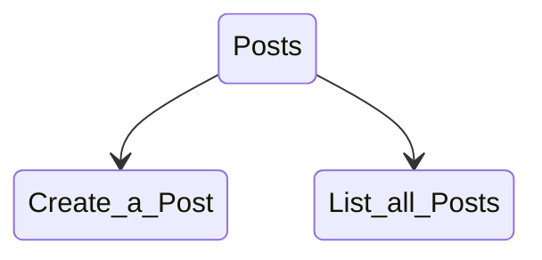

<SwmSnippet path="/posts/index.js" line="14">

---

&nbsp;

```javascript
app.get('/posts', (req, res) => {
    res.send(posts);
});

app.post('/posts/', (req, res) => {
    const id = randomBytes(4).toString('hex');
    const {title} = req.body;

    posts[id] = {
        id, title
    };

    res.status(201).send(posts[id]);
});
```

---

</SwmSnippet>

<SwmMeta version="3.0.0" repo-id="Z2l0aHViJTNBJTNBc3dpbW0lM0ElM0FIZW5yaWtTYWVnYQ==" repo-name="swimm"><sup>Powered by [Swimm](https://app.swimm.io/)</sup></SwmMeta>
